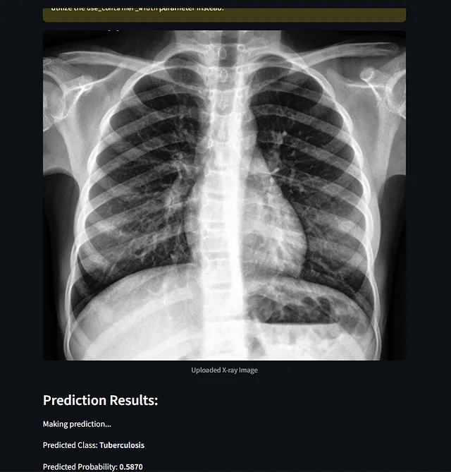
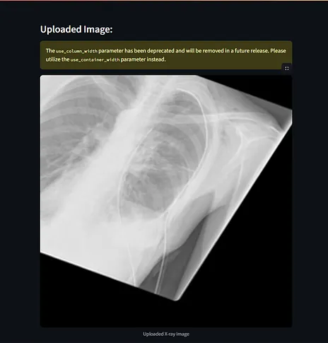
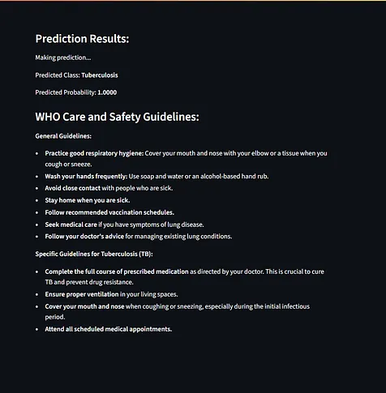
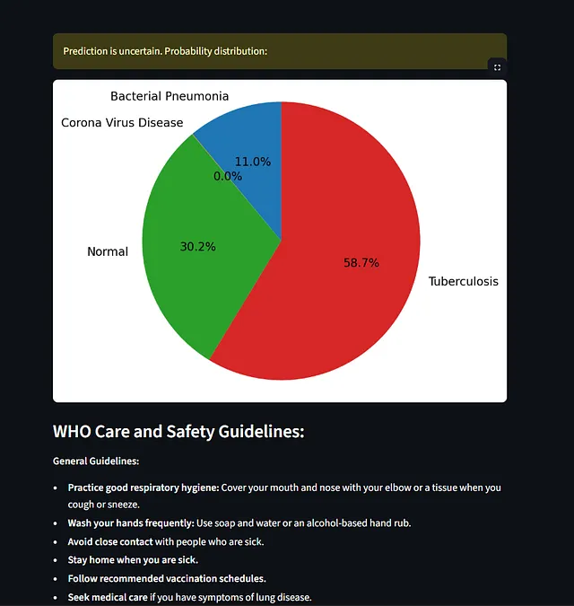
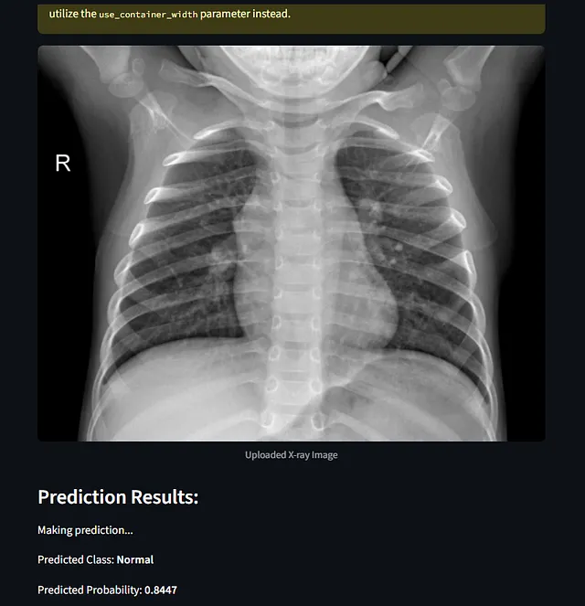
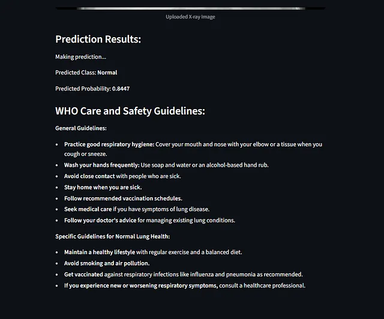

# 🫁 Lung Disease Prediction & Explanation using CNN (DenseNet201)

  

  <strong>AI-powered chest X-ray analysis for early lung disease detection</strong> 
  Built using Deep Learning (CNN) and deployed via Streamlit

  <a href="https://lungdiseasecnn-fulypbrimr9tdvs8qlh9tm.streamlit.app/" target="_blank"><b>▶ Live Demo</b></a> |
  <a href="https://github.com/AdityaRKori" target="_blank"><b>GitHub</b></a>

---

## Quick Project Snapshot

**LungDiseaseCNN**  
This model uses **DenseNet201** to analyse and classify chest X-ray images into disease categories. The deployed version classifies into three primary types: **Tuberculosis (TB), Bacterial Pneumonia, COVID-19** (plus Normal in some builds).  
Live demo: https://lungdiseasecnn-fulypbrimr9tdvs8qlh9tm.streamlit.app/

---

## 📌 Problem Statement

Lung diseases such as **Tuberculosis, Pneumonia, and COVID-19** remain major contributors to global morbidity and mortality.  
Early detection through chest X-rays is critical, yet:

- Radiology expertise is limited in many regions  
- Manual interpretation is time-consuming  
- Diagnostic accuracy can vary by experience level  
- Large-scale screening is difficult in resource-constrained settings

There is a strong need for an **AI-assisted decision-support system** that can quickly screen chest X-rays and highlight potential lung conditions with confidence scores.

---

## 🎯 Solution Overview

This project implements a **Convolutional Neural Network (CNN)** based on **DenseNet201** to classify chest X-ray images into clinically relevant categories (TB, Bacterial Pneumonia, COVID-19, Normal depending on dataset variant). The trained model is deployed using a **Streamlit web application**, allowing users to upload X-ray images and instantly receive predictions along with probability distributions and WHO-aligned care guidelines.

---

## 🧠 Model Architecture

**Base Network**
- DenseNet201 (pretrained on ImageNet)
- Used for deep feature extraction from X-ray images

**Custom Classification Head**
- GlobalAveragePooling2D  
- Dense (1024 units, ReLU)  
- Dense (4 units, Softmax)  *(or 3-class head for the LungDiseaseCNN minimal variant)*

This hybrid design combines the representational strength of DenseNet with a lightweight classifier tailored to medical imaging.

---

## 🧪 Dataset & Preprocessing

**Dataset Structure**
- Organized into `train / validation / test` directories
- Classes include TB, Bacterial Pneumonia, COVID-19, and Normal (depending on configuration)

**Preprocessing Steps**
- Pixel normalization to range `[0, 1]`  
- Image resizing to model input size  
- Real-time data augmentation:
  - Rotation
  - Width & height shifting
  - Shearing
  - Zooming
  - Horizontal flipping

These steps improve generalization and reduce overfitting.

---

## ⚙️ Training Configuration

- **Framework:** TensorFlow / Keras  
- **Optimizer:** Adam  
- **Learning Rate:** 0.0001  
- **Loss Function:** Categorical Cross-Entropy  
- **Metric:** Accuracy  
- **Epochs:** 10  
- **Batch Loading:** ImageDataGenerator

---

## 📊 Model Evaluation

Performance on unseen test data (example run):

- **Accuracy:** ~96.14%  
- **Loss:** ~0.1375

Additional evaluation artifacts:
- Confusion Matrix (per-class performance)  
- Classification Report (precision, recall, F1-score)

The model demonstrates strong discriminatory power across bacterial, viral, TB, and healthy lung patterns.

---

## 🖥️ Application Interface (Streamlit)

The Streamlit app provides an end-to-end diagnostic experience.

---

### 🔹 Upload & Prediction Interface
**File:**   
Users upload a chest X-ray image (PNG/JPG/JPEG). Optional patient information can be entered for contextual tracking.

---

### 🔹 Uploaded X-ray Preview
**File:** 
Displays the uploaded chest X-ray for visual confirmation before prediction.

---

### 🔹 High-Confidence Disease Prediction
**File:**   
Shows:
- Predicted disease class  
- Prediction probability  
- WHO-aligned care and safety guidelines specific to the disease

---

### 🔹 Probability Distribution for Uncertain Cases
**File:** 
When confidence is lower, a pie chart displays probability distribution across all classes, enabling informed interpretation rather than a single hard label.

---

### 🔹 Normal Lung Classification
**File:** 
Demonstrates accurate differentiation between diseased and healthy lungs with high confidence.

---

### 🔹 WHO Care & Safety Guidance Display
**File:** 
Automatically surfaces general and disease-specific WHO care recommendations based on the predicted class.

---

## 🏥 Impact & Use Cases

- **Radiologists:** AI-assisted screening and second-opinion support  
- **Hospitals:** Rapid triage and pre-screening tool  
- **Public Health:** Early detection in TB and pneumonia-heavy regions  
- **Researchers:** Reference implementation of DenseNet-based transfer learning in medical imaging

---

## ⚠️ Medical Disclaimer

This application is intended for **educational and decision-support purposes only**.  
It does **not** replace professional medical diagnosis.  
Always consult a qualified healthcare provider for clinical decisions.

---

## 📂 Project Structure

├── app.py # Streamlit application
├── model/ # Trained CNN model
├── data/ # Dataset (train/val/test)
├── requirements.txt # Dependencies
├── README.md

---

## 🚀 How to Run Locally

git clone https://github.com/AdityaRKori/Lung-Disease-Prediction.git
cd Lung-Disease-Prediction

python -m venv venv
source venv/bin/activate   # macOS / Linux
venv\Scripts\activate      # Windows

pip install -r requirements.txt
streamlit run app.py
👤 Author & Credits
Author: Aditya K
Model Backbone: DenseNet201
Frameworks: TensorFlow, Keras, Streamlit

🔗 LinkedIn: https://www.linkedin.com/in/aditya-kori-0853b6229

🔗 Related Links
Live demo (LungDiseaseCNN): https://lungdiseasecnn-fulypbrimr9tdvs8qlh9tm.streamlit.app/

Repository (example): https://github.com/AdityaRKori

📄 License
MIT License
